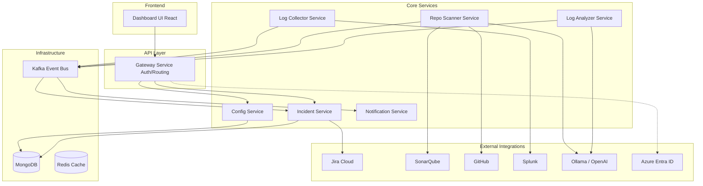

# DevSecOps Pro

DevSecOps Pro is an enterprise-grade, event-driven microservices platform designed to orchestrate and automate security scanning, log analysis, and incident management across a multi-environment architecture.

## Overview
The platform seamlessly integrates with external systems like Jira, SonarQube, GitHub, and Splunk to provide a centralized pane of glass for security operations. It leverages LLMs (both local and cloud-based) to analyze vulnerabilities and logs, generating automated remediation steps.

## High-Level Design (HLD)

## Features
- **Multi-Tenant Architecture**: Robust data isolation across multiple tenants.
- **RBAC**: Deep integration with Azure Entra ID (mocked in DEV).
- **Event-Driven**: Fully decoupled asynchronous processing via Apache Kafka.
- **LLM Integration**: Langchain4j integration supporting local (Ollama) and cloud (OpenAI/Azure) models.

## Setup Guides
Please select the appropriate setup guide for your target environment:
- [Development Environment Setup](./guides/SETUP_GUIDE_DEV.md)
- [QA & UAT Environment Setup](./guides/SETUP_GUIDE_QA_UAT.md)
- [Production Environment Setup](./guides/SETUP_GUIDE_PROD.md)
- [Technical Guide & Architecture Details](./guides/TECHNICAL_GUIDE.md)
