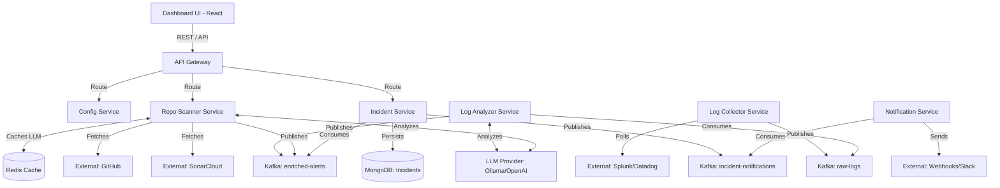
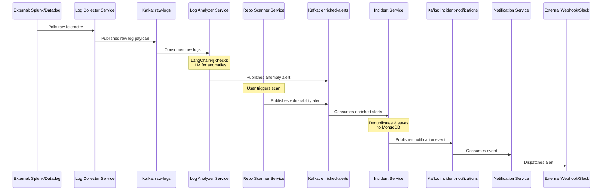
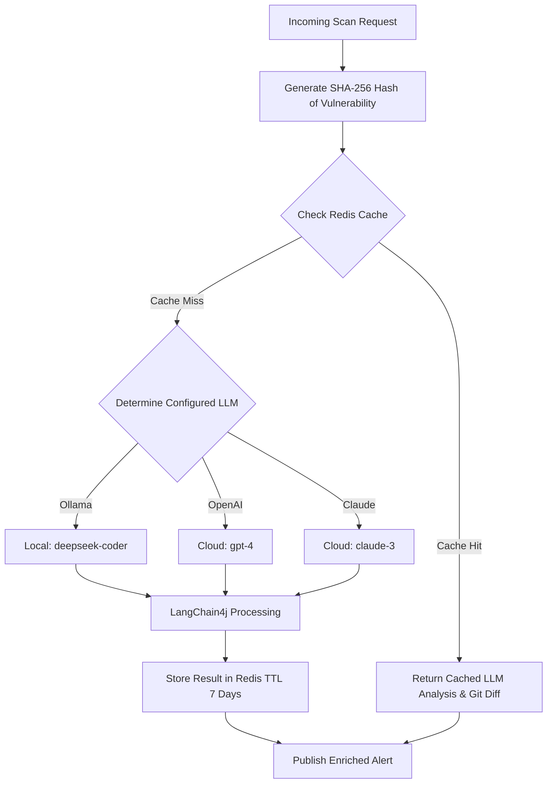
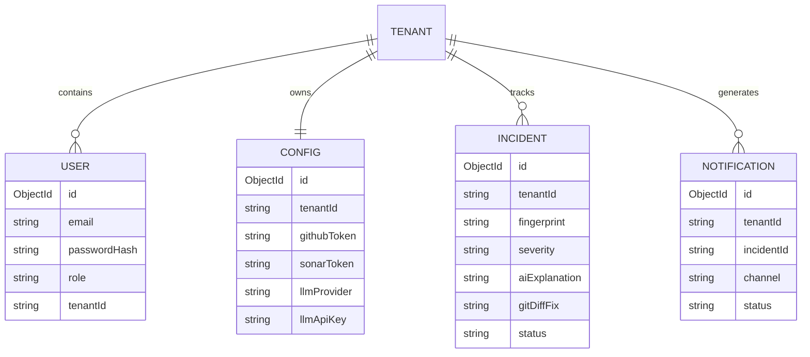
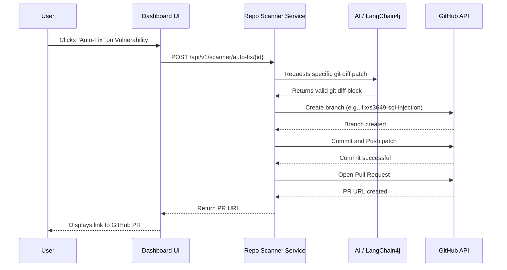

# DevOps Pro Microservices - Comprehensive DevSecOps Platform

Welcome to the **DevOps Pro Microservices** ecosystem. This platform is a next-generation, AI-driven DevSecOps automation suite designed to act as a force multiplier for software engineering and security teams.

By leveraging Large Language Models (LLMs) via **LangChain4j**, Apache Kafka for event streaming, and Spring Boot for robust microservice orchestration, this platform automates the traditionally manual processes of:
1. Identifying infrastructure anomalies.
2. Flagging static code analysis vulnerabilities.
3. Generating human-readable explanations of complex security flaws.
4. Automatically proposing and raising Pull Requests with exact code fixes.
5. Triaging and routing alerts to external channels (Slack, Webhooks).

---

## 📑 Table of Contents
1. [Core Features](#core-features)
2. [Technology Stack](#technology-stack)
3. [High-Level Architecture (HLD)](#high-level-architecture-hld)
4. [In-Depth Application Flows](#in-depth-application-flows)
5. [Service & Sub-Module Catalog](#service--sub-module-catalog)
6. [Data Persistence & Streaming](#data-persistence--streaming)
7. [Getting Started & Local Setup](#getting-started--local-setup)
8. [Azure Deployment](#azure-deployment)
9. [Multi-Tenancy Details](#multi-tenancy-details)
10. [Troubleshooting & FAQs](#troubleshooting--faqs)

---

## 🌟 Core Features

- **Automated Root Cause Analysis (RCA)**: Instead of just forwarding raw Splunk stack traces, the AI analyzes the trace to tell you *why* it happened (e.g., "The HikariCP connection pool is exhausted due to an unclosed transaction").
- **Auto-Remediation**: Translates SonarCloud security flaws (e.g., SQL Injections, XSS) into working `git diff` patches and opens automated PRs on GitHub.
- **Strict Multi-Tenancy**: Built from the ground up for SaaS. All configurations, incidents, and LLM preferences are strictly segregated by `X-Tenant-Id`.
- **Cost-Optimized AI Cache**: Employs an aggressive Redis caching layer to ensure that identical vulnerabilities discovered across different repositories don't trigger redundant, expensive LLM calls.

---

## 🛠️ Technology Stack

- **Backend Core**: Java 21, Spring Boot 3.3.x, Spring Cloud Gateway
- **Event Streaming**: Apache Kafka (with Zookeeper)
- **Databases**: MongoDB (Document Store), Redis (Distributed Caching)
- **AI & Integrations**: LangChain4j, Ollama, OpenAI, Anthropic Claude, SonarCloud, GitHub API
- **Frontend**: React 18, Vite, Tailwind CSS, Axios
- **Infrastructure**: Docker, Docker Compose, Kubernetes, Azure AKS

---

## 🗺️ High-Level Architecture (HLD)

The entire ecosystem communicates asynchronously to ensure extreme resilience under high-volume log ingestion and code scanning loads.

## 🌐 Azure Deployment

This platform supports both local development with Floci-AZ emulators and production deployment to Azure. The architecture is designed with an Azure-first approach to ensure production-grade reliability and scalability while maintaining the flexibility for local development and testing. The deployment strategy includes:

### Local Development with Floci-AZ
- Uses Floci-AZ emulator for local Azure service simulation
- Supports all Azure services locally without requiring Azure credentials
- Enables rapid development and testing cycles
- Maintains identical configuration between local and production environments

### Production Deployment to Azure
- Deploys to Azure Kubernetes Service (AKS) for production environments
- Utilizes Azure Cosmos DB for data persistence
- Implements Azure Cache for Redis for distributed caching
- Integrates with Azure Key Vault for secrets management
- Leverages Azure Monitor and Application Insights for comprehensive monitoring
- Implements Azure AD authentication for enterprise security

### Deployment Process
1. Local development with `.\deploy.ps1 azure` command
2. Automated deployment to Azure using Terraform infrastructure as code
3. CI/CD pipelines for continuous delivery to Azure environments
4. Seamless transition between local development and production deployment

## Getting Started & Local Setup

### Prerequisites
- Docker Desktop installed and running
- PowerShell 5.1 or higher
- Git

### Local Development Setup
1. Clone the repository
2. Run `.\deploy.ps1 azure` to start local development with Floci-AZ emulators
3. All services will be available at `http://localhost`

### Production Deployment
1. Configure Azure credentials and subscription details
2. Run `terraform init` and `terraform apply` in the `terraform` directory
3. Services will be deployed to Azure AKS cluster with proper monitoring and security configurations



---

## 📡 Kafka Architecture & Event Flow

The platform relies heavily on Apache Kafka to decouple data ingestion from AI processing and alerting.



---

## 🧠 AI Inference & Caching Flow

To optimize token usage, minimize latency, and prevent redundant LLM calls for identical static analysis findings across different repositories, the platform employs a sophisticated caching architecture.



---

## 🗄️ Entity-Relationship Diagram (Multi-Tenancy)

All MongoDB databases strictly enforce logical isolation using the `tenantId` field to support B2B SaaS operations.



---

## 🛠️ Automated Remediation (Auto-Fix) Flow

A cornerstone feature of DevOps Pro is its ability to not just identify issues, but actively fix them by interacting with GitHub.



---

## 🌐 API Endpoints Cheat Sheet

Below are the most critical REST endpoints. All traffic routes through the API Gateway (`http://localhost:8080`) and requires a Bearer JWT token (except Login).

| Service | Endpoint | Method | Purpose |
|---------|----------|--------|---------|
| **Gateway** | `/api/v1/auth/login` | `POST` | Authenticates user & returns JWT |
| **Config** | `/api/v1/config/settings` | `GET/PUT` | Manages Tenant integrations & LLMs |
| **Config** | `/api/v1/config/test-connection/{prov}`| `POST` | Tests connectivity to Ollama/OpenAI/Splunk |
| **Scanner** | `/api/v1/scanner/scan?repo={name}` | `POST` | Triggers a proactive SAST repository scan |
| **Scanner** | `/api/v1/scanner/auto-fix/{id}` | `POST` | Triggers the GitHub auto-fix PR sequence |
| **Scanner** | `/api/v1/scanner/regenerate/{id}` | `POST` | Evicts Redis cache and forces a new LLM analysis |
| **Incident**| `/api/v1/incidents` | `GET` | Fetches all deduplicated, enriched alerts |

---

## 🔄 In-Depth Application Flows

### 1. The Proactive Code Scanning & Auto-Fix Flow
1. **Trigger**: A user clicks "Scan" on a repository in the Dashboard UI.
2. **Routing**: The `gateway-service` intercepts the request, validates the JWT, extracts the tenant context, and proxies the request to the `repo-scanner-service`.
3. **Ingestion**: The Scanner utilizes the tenant's stored GitHub and SonarCloud credentials (fetched dynamically from `config-service`) to pull active vulnerabilities.
4. **AI Enrichment**: The Scanner queries the configured LLM to generate a detailed explanation of "WHY" the issue is a risk, "HOW" to fix it, and an exact `git diff`. 
    - *Optimization*: The Scanner hashes the vulnerability signature and checks **Redis** first. If a match is found, the LLM call is bypassed.
5. **Ticketing**: The enriched alert payload is published to the `enriched-alerts` Kafka topic. The `incident-service` consumes it, deduplicates it, and persists it to MongoDB.
6. **Remediation**: The user reviews the AI's proposed code diff in the UI and clicks "Auto-Fix", which instructs the `repo-scanner-service` to leverage the GitHub API to branch, apply the patch, and open a Pull Request.

### 2. The Background Telemetry & Anomaly Flow
1. **Ingestion**: The `log-collector-service` executes scheduled CRON tasks, polling external observability platforms (like Splunk) for recent telemetry.
2. **Buffering**: To prevent overwhelming the AI, raw logs are pushed to the `raw-logs` Kafka topic buffer.
3. **AI Analysis**: The `log-analyzer-service` consumes the logs. It uses few-shot prompting via LangChain4j to classify if the log represents a legitimate anomaly.
4. **Alerting**: If flagged as anomalous, the payload is enriched with the AI's diagnostic findings and pushed to Kafka. It is ingested by the `incident-service`, and finally dispatched as an outbound Webhook/Slack message by the `notification-service`.

---

## 🏗️ Service & Sub-Module Catalog

Each microservice is entirely self-contained. For in-depth Low-Level Design (LLD), API contracts, and development instructions, explore the specific `README.md` within each module:

1. **[Gateway Service](./gateway-service/README.md)**: Built on Spring Cloud Gateway. Handles routing, Authentication (JWT), and automated database seeding on startup.
2. **[Config Service](./config-service/README.md)**: Multi-tenant configuration and integration management (GitHub, Sonar, Splunk).
3. **[Log Collector Service](./log-collector-service/README.md)**: Telemetry ingestion. Contains advanced Mock generators to simulate realistic production errors (OOMs, NPEs).
4. **[Log Analyzer Service](./log-analyzer-service/README.md)**: AI-driven log parsing and anomaly classification utilizing LangChain4j.
5. **[Repo Scanner Service](./repo-scanner-service/README.md)**: SAST ingestion, AI code remediation generation, and GitHub PR automation.
6. **[Incident Service](./incident-service/README.md)**: Central repository for all alerts. Handles deduplication and persistence to MongoDB.
7. **[Notification Service](./notification-service/README.md)**: Outbound alerting dispatcher for Webhooks and Slack integrations.
8. **[Dashboard UI](./dashboard-ui/README.md)**: Modern React/Vite Single Page Application serving as the visual control plane.

---

## 🗄️ Data Persistence & Streaming

### MongoDB Databases
- `devops_users`: User credentials and tenant mappings.
- `devops_config`: Integration credentials, API keys, and LLM provider settings.
- `devops_incidents`: Deduplicated, enriched anomalies and vulnerabilities.
- `devops_notifications`: History and metadata for outbound alerts.

### Kafka Topics
- `raw-logs`: High-throughput buffer for raw telemetry data fetched by the collector.
- `enriched-alerts`: Normalized alerts that have been processed and augmented by the AI services.
- `incident-notifications`: Trigger events instructing the Notification Service to dispatch Webhooks/Emails.

---

## 🚀 Getting Started & Local Setup

### Prerequisites
- Docker Engine (v24.0+)
- Docker Compose (v2.20+)
- At least 8GB of RAM allocated to Docker.

### Running the Stack
The entire application can be run seamlessly via Docker Compose, requiring zero local dependencies. It automatically provisions Kafka, Zookeeper, Redis, MongoDB, and all 8 microservices.

**Want to run the services individually for local development?**
Check out our extremely detailed **[Local Development Setup Guide (DEV_SETUP.md)](./DEV_SETUP.md)** which covers IDE setup, running the React frontend independently, default credentials, and mock configuration!

```bash
# Clone the repository
git clone https://github.com/your-org/devops-pro.git
cd devops-pro

# Spin up the infrastructure and services
docker-compose -f docker-compose.yml -f docker-compose.dev.yml up -d --build
```

### Access Points
Once the containers are healthy, you can access the platform here:
- **UI Dashboard**: `http://localhost:5173`
- **API Gateway (REST API Base)**: `http://localhost:8080`
- **MongoDB**: `mongodb://localhost:27018`
- **Redis**: `localhost:6379`
- **Kafka**: `localhost:9092`

---

## 🏢 Multi-Tenancy Details

This platform is a B2B SaaS architecture. It requires the HTTP header `X-Tenant-Id` to be passed on every single backend API request.
- **UI Flow**: When a user logs in, the Gateway validates their credentials and returns a JWT containing their `tenantId`.
- **API Flow**: The UI attaches `Authorization: Bearer <token>` to requests. The Gateway strips the token, extracts the tenant, and injects `X-Tenant-Id` before routing to downstream microservices.
- **Data Isolation**: Repositories, Configurations, and Incidents in MongoDB are all partitioned logically using the `tenantId` field.

---

## 🔧 Troubleshooting & FAQs

**Q: My UI is showing a blank screen or failing to connect.**
Ensure the API Gateway is running (`docker ps | grep gateway-service`). If it was restarted rapidly, do a hard refresh in your browser (`Ctrl + F5`) to clear cached React states.

**Q: I cannot connect to MongoDB Compass locally.**
Ensure you are connecting to `mongodb://localhost:27018`. We map the internal `27017` port to `27018` on the host to avoid conflicting with any pre-existing local MongoDB installations on your Windows/Mac machine.

**Q: The AI is taking a very long time to generate a description.**
If you are using local LLMs (like Ollama running deep-seek coder), inference can be slow depending on your GPU. The response is cached in Redis after the first successful run. To force a regeneration, click "Regenerate" in the UI, which explicitly evicts the Redis key and triggers a new LLM inference cycle.

**Q: How do I test the application without real Splunk or SonarCloud credentials?**
The system is built with robust Mock Controllers. Ensure your Tenant Configuration in the UI is set to use the "DevOps Pro Internal Mocks", and the system will automatically stream realistic Java stack traces and SQL Injection vulnerabilities into the pipeline!
